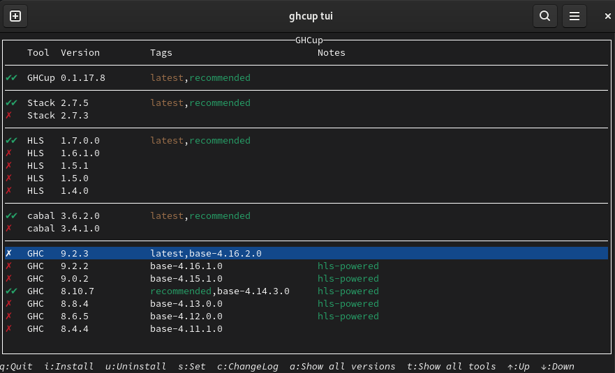

# Haskell

- [Haskell](#haskell)
  - [GHCup](#ghcup)
    - [Fedora 35](#fedora-35)
    - [Windows 11](#windows-11)
  - [GHC](#ghc)
    - [Fedora 35](#fedora-35-1)
  - [GHCi: GHC's interactive environment](#ghci-ghcs-interactive-environment)
  - [Setup](#setup)
    - [Stack Project](#stack-project)
    - [Cabal Project](#cabal-project)
  - [참조](#참조)

## GHCup

- [GHCup](https://www.haskell.org/ghcup/)

### Fedora 35

```sh
curl --proto '=https' --tlsv1.2 -sSf https://get-ghcup.haskell.org | sh
# source ${HOME}/.ghcup/env
source ${HOME}/.zshrc
```

```sh
ghcup tui
```



### Windows 11

```ps
Set-ExecutionPolicy Bypass -Scope Process -Force;[System.Net.ServicePointManager]::SecurityProtocol = [System.Net.ServicePointManager]::SecurityProtocol -bor 3072;Invoke-Command -ScriptBlock ([ScriptBlock]::Create((Invoke-WebRequest https://www.haskell.org/ghcup/sh/bootstrap-haskell.ps1 -UseBasicParsing))) -ArgumentList $true
```

```ps
ghcup list
```

## GHC

- [GHC](https://www.haskell.org/ghc/distribution_packages.html): Glasgow Haskell Compiler

### Fedora 35

```sh
dnf install ghc
dnf module list ghc
```

## GHCi: GHC's interactive environment

```haskell
sh> ghci

GHCi, version 8.10.5: https://www.haskell.org/ghc/  :? for help
Prelude> 5 / 2
2.5
```

## Setup

```sh
cp .ghci ${HOME}/.ghci
```

### Stack Project

```sh
stack new sample --bare
cd sample
stack test
```

### Cabal Project

```sh
cabal init
cabal configure
cabal bulid
```

## 참조

- [가장 쉬운 하스켈 책](https://www.aladin.co.kr/shop/wproduct.aspx?isbn=9788994774619)
  - [Learn You a Haskell for Great Good!](http://learnyouahaskell.com)
- [Learn Haskell in One Video](https://www.newthinktank.com/2015/08/learn-haskell-one-video/)
